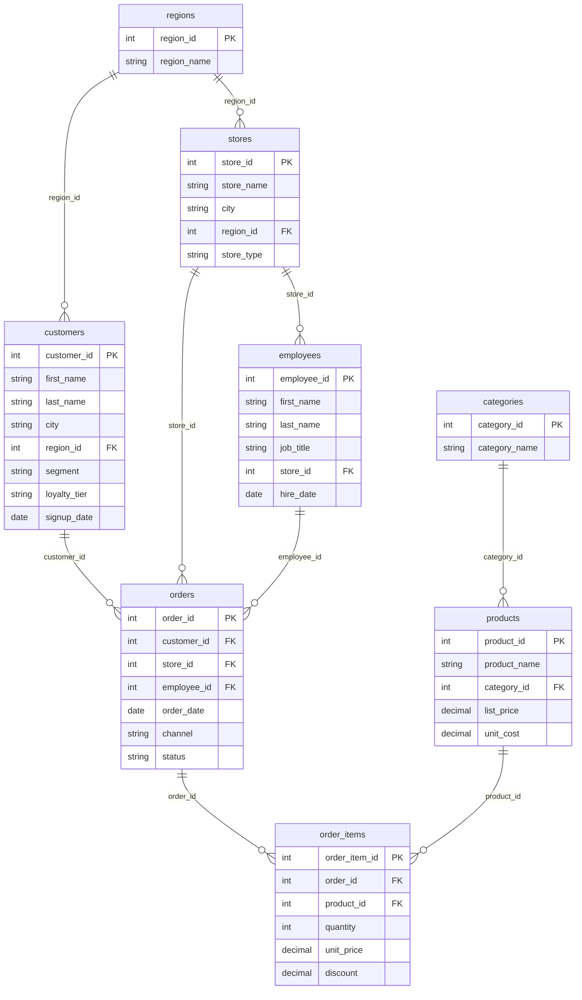

# 🤖 AI SQL Assistant

**Ask your company database questions in plain English.**

Most people in a company can't write SQL, so every data question waits for an analyst.
This app lets anyone **ask the company database a question in plain English**. The AI (Google Gemini)
writes the SQL, including the JOINs across tables, the database runs it, and the user gets a
**chart, a table and a plain-English answer**.

**Live demo:** _add your Streamlit Cloud link here_

## What it does

- **Plain-English questions →** *"Revenue and profit margin by region last year"*
- **AI writes the SQL** using the table relationships and the company's metric definitions
- **Picks the right chart**: a line for trends, a bar for comparisons, a pie for shares, a big number for single values
- **Explains the result** in 1-3 sentences a manager can read
- **Follow-up questions** work: *"now only for the West region"*
- **Fixes its own mistakes**: if a query fails, the error goes back to the AI and it corrects the SQL
- **Shows its work**: every answer has the SQL, the tables it joined and how long it took

## The database

A realistic retail database for a made-up company, **Acme Retail Co.**: 8 related tables, about 50,000 rows,
and 3 years of orders. The data is generated (no real customer data), with real patterns to find:
holiday peaks, online sales growing, the West buying more electronics, and clothing being returned more often.



| Table | What's in it |
|---|---|
| `regions` | Sales regions the company operates in. |
| `stores` | Physical stores plus one online store. |
| `employees` | Staff who make the sales. |
| `customers` | People and businesses who buy from the company. |
| `categories` | Product categories. |
| `products` | Everything the company sells. |
| `orders` | One row per customer order. |
| `order_items` | The products inside each order (one row per product per order). |

The diagram also appears in the app (**Database & relationships** tab) and in [docs/er_diagram.html](docs/er_diagram.html).

## How it works

```
Question in English
      │
      ▼
Gemini reads: table schema + relationships (PK/FK) + business rules ("revenue = ...")
      │
      ▼
Gemini writes: one SQL query  +  a chart choice (line / bar / pie / none)
      │
      ▼
DuckDB runs the SQL (read-only)  ──fails?──►  error goes back to Gemini, which fixes the query
      │
      ▼
Chart + table  +  Gemini explains the result in plain English
```

**Why the answers are accurate:** the AI gets more than column names. It also gets
- a description of every table and column,
- the allowed values of text columns (e.g. status is 'Completed', 'Returned' or 'Cancelled'),
- the foreign keys to join on,
- the **business rules**: how the company defines revenue, profit and return rate. Without these, two people asking for "revenue" could get two different numbers.

**Safety:** only a single `SELECT` statement can run (checked with DuckDB's own SQL parser), and the database
can't read files or reach the internet.

## Tech stack

Python · Streamlit · DuckDB (SQL) · pandas · Plotly · Google Gemini API

| File | What it does |
|---|---|
| `app.py` | The app: the AI prompts, running the SQL, charts and the page layout |
| `database.py` | Table definitions, relationships, business rules and the data generator |
| `requirements.txt` | Python packages |
| `.env` | Your API key (stays on your computer, never uploaded) |

## Run it on your computer

```bash
python3 -m venv .venv
source .venv/bin/activate
pip install -r requirements.txt
cp .env.example .env   # then open .env and paste your Gemini key
streamlit run app.py
```

Get a Gemini API key at **https://aistudio.google.com/apikey**.

## Deploy for free (Streamlit Community Cloud)

1. Push this folder to a **public GitHub repo**. `.env` is in `.gitignore`, so your key is never uploaded.
2. Go to **https://share.streamlit.io**, sign in with GitHub, click **Create app**, and pick your repo and `app.py`.
3. Streamlit Cloud doesn't read `.env` files. Instead, open **Advanced settings → Secrets** and paste the same line, with quotes:
   ```toml
   LLM_API_KEY = "your-gemini-key"
   ```
   Only you can see this box. The key stays on Streamlit's server and never reaches visitors' browsers.
4. Click **Deploy**. After about 2 minutes you get a public link like `https://ai-sql-assistant.streamlit.app` (you choose the name).

### Protecting your AI credit
The app is public, so visitors' questions use your Gemini credit. It has built-in limits:
- **Daily cap for the whole site:** at most `QUESTIONS_PER_DAY` (default 200) new AI questions per day. After that, the app stops calling the AI until tomorrow.
- **Per-visitor limit:** at most `QUESTIONS_PER_VISITOR` (default 20) new questions per visit.
- **Answer cache:** a question someone already asked is answered again from memory, for free and instantly.
- Questions longer than 300 characters are rejected.

You can change the limits in `.env`, or in the Secrets box when deployed, e.g. `QUESTIONS_PER_DAY = 100`.
As a backup, set a budget alert in Google Cloud (**Billing → Budgets & alerts**).

> Free apps go to sleep after a few days without visitors. Anyone who opens the link can wake the app with one click.

To use another AI provider, set `LLM_BASE_URL` and `LLM_MODEL` in `.env` (and in the Secrets box when deployed).
Any OpenAI-compatible API works, e.g. Groq (`https://api.groq.com/openai/v1`, `llama-3.3-70b-versatile`).

## Resume bullet points

- Built and deployed **AI SQL Assistant**, an AI text-to-SQL app (Python, Streamlit, DuckDB, Google Gemini) that lets non-technical users query an **8-table relational database** in plain English.
- Designed the prompt with **schema metadata, foreign-key relationships and business metric definitions**, so the LLM generates correct multi-table JOINs and consistent KPIs.
- Added **usage limits and answer caching** to control API cost on the public demo, plus **automatic chart selection**, plain-English answers, follow-up questions and a **self-correcting retry loop** that feeds SQL errors back to the model; queries run **read-only**.
